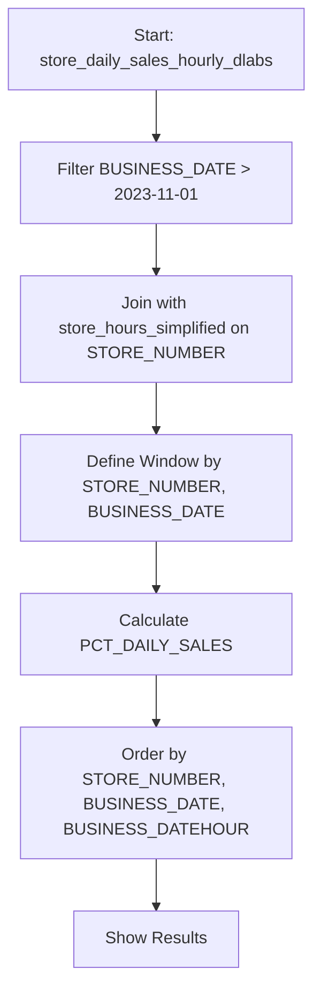
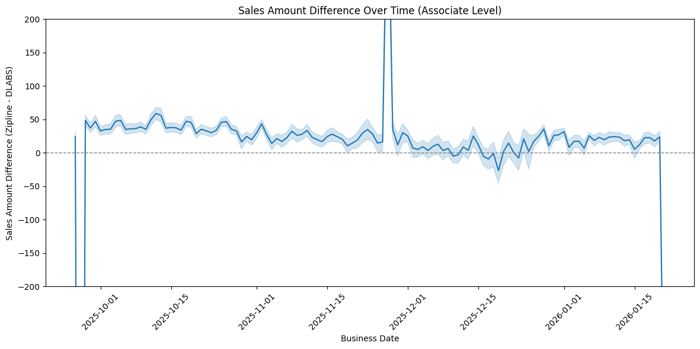
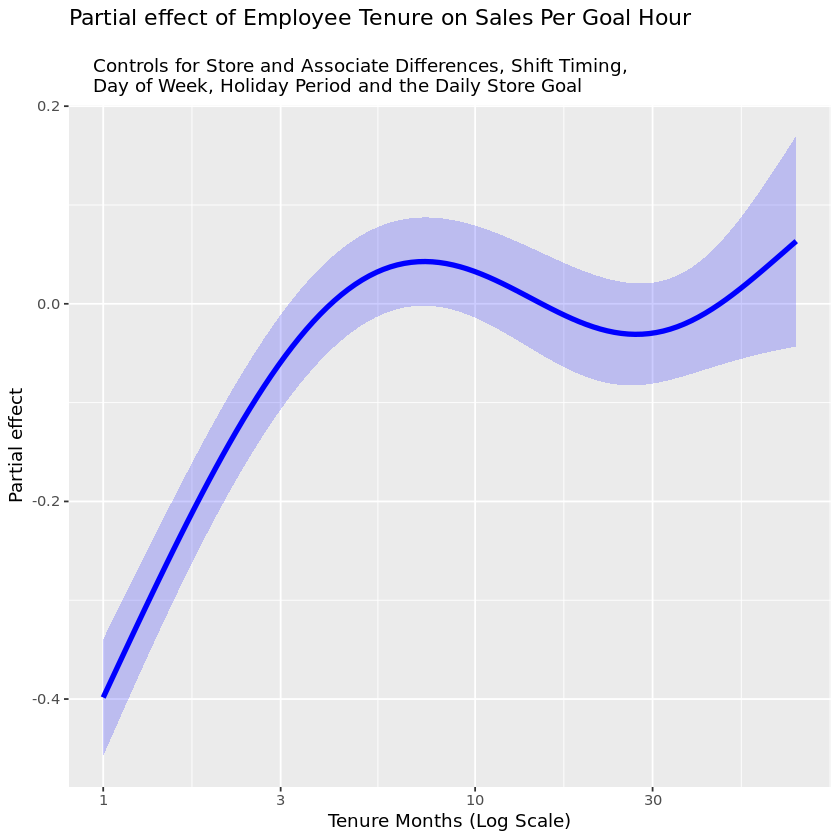

# Data Cleaning Notes
## Data Files

1. Cleaned up Naming - aligned on SALES_ASSOCIATE, BUSINESS_DATE, STORE_NUMBER across all datasets
2. Store Hours - dropped duplicates based on STORE_NUMBER and BUSINESS_DATE, keeping the most recent
3. Associate Daily Schedule - dropped duplicates based on STORE_NUMBER, BUSINESS_DATE, and SALES_ASSOCIATE
4. Store Data ('Snowflake_VW_RPT_SPOG_EMP_CURRENT_DAY_2026-01-21') - dropped duplicates based on STORE_NUMBER, keeping the most recent

## Data Quality Issues

1. Store Hours - some records have missing or 0 values for OPENING_TIME and CLOSING_TIME, which may impact analysis of store operating hours. 1202 and 7301 both have this, I imputed with 10 and 20. 
2. Store Hours are only available for a short time period (2026-01-01 to 2026-01-21), which may limit analysis of store hours trends over time. I took the most common open and close time but that might be incorrect during holiday and needs to be revisited. TODO!
3. Some Store Manager Goals are 0. 
4. Some Associate Goal Hours are longer than the possible remaining open hours based on their shift start time. 
5. Associate IDs may have an issue making calculating Tenure before 2020 difficult. 
6. 9 Stores are missing significant data in the analysis period. 
7. There are some differences between Zipline Associate / Store Sales and DLABS. 

8. Store Hours File is corrupted. 

9. Store Hours before 2025-11 seems to default. 

# Store Hours Analysis

Sales Goals started earlier in some stores but consistently are present in all stores by 2026-01-21. Store hours are mostly consistent across stores, with most stores opening at 10:00 and closing at 21:00. 

Store Goals are pretty similar across stores with some minor variation. 
Largely they are pretty accurate compared to actual sales


The core algorithm is this: 

```python
from snowflake.snowpark.window import Window
window_spec = Window.partition_by('STORE_NUMBER', 'BUSINESS_DATE')
store_daily_sales_hourly_adjusted = store_daily_sales_hourly_dlabs.filter(F.col('BUSINESS_DATE') > F.lit('2023-11-01'))
store_daily_sales_hourly_adjusted = store_daily_sales_hourly_adjusted.join(store_hours_simplified, using_columns = ['STORE_NUMBER'], how = 'inner')
store_daily_sales_hourly_adjusted = store_daily_sales_hourly_adjusted.with_column('PCT_DAILY_SALES', F.col('NET_SALES_AMOUNT_DLABS') / F.nullifzero(F.sum('NET_SALES_AMOUNT_DLABS').over(window_spec))).order_by(['STORE_NUMBER', 'BUSINESS_DATE', 'BUSINESS_DATEHOUR'])
store_daily_sales_hourly_adjusted.show()
```
## Algorithm Steps

1. **Define a Window**: Partition the data by `STORE_NUMBER` and `BUSINESS_DATE` to enable calculations within each store and day.
2. **Filter Data**: Select records from `store_daily_sales_hourly_dlabs` where `BUSINESS_DATE` is after `2023-11-01`.
3. **Join Data**: Merge the filtered sales data with `store_hours_simplified` on `STORE_NUMBER` to add store hours information.
4. **Calculate Percentage of Daily Sales**: For each row, compute `PCT_DAILY_SALES` as the hourly sales divided by the total daily sales for that store and date.
5. **Order Results**: Sort the results by `STORE_NUMBER`, `BUSINESS_DATE`, and `BUSINESS_DATEHOUR`.
6. **Display Output**: Show the resulting DataFrame.

### Diagram




There is clearly a seasonality pattern with sales moving earlier in the day during the winter months. It's very slight so it's a discussion if this is worth the added complexity of maintaining multiple % Sales calculations or just using a single one. 


I could group this but it later becomes a challenge given the associate goals will be hourly. 


### Redistribution of Store Goals

In certain cases, a store might stay open longer or close earlier than the standard hours the model has- in that case, we can redistribute the goal evenly across the new hours using a function like this from the `dotnet add package MathNet.Numerics` library

```C# 
using MathNet.Numerics;
using MathNet.Numerics.Interpolation;

public static double[] RedistributeHourlyPercentages(double[] baselinePercentages, int newHours)
{
    int baselineHours = baselinePercentages.Length;
    
    // Create x positions for baseline hours (1, 2, 3, ..., N)
    double[] xOld = Enumerable.Range(1, baselineHours)
                              .Select(x => (double)x)
                              .ToArray();
    
    // Linear interpolation (same as np.interp)
    var interpolator = LinearSpline.Interpolate(xOld, baselinePercentages);
    
    // Generate new x positions (1, 2, 3, ..., M)
    return Enumerable.Range(1, newHours)
                     .Select(x => interpolator.Interpolate(x))
                     .ToArray();
}

// Example usage:
var baseline = new[] { 0.10, 0.20, 0.30, 0.40, 0.50, 0.60, 0.70, 0.80, 0.90, 1.00 };

var extended = RedistributeHourlyPercentages(baseline, 12);
// [0.083, 0.167, 0.25, 0.333, 0.417, 0.5, 0.583, 0.667, 0.75, 0.833, 0.917, 1.0]

var shortened = RedistributeHourlyPercentages(baseline, 8);
// [0.129, 0.257, 0.386, 0.514, 0.643, 0.771, 0.9, 1.0]
```

# Associate Goals

## Data
1. Need to pass a table of Associate Tenure from the DLABS Sales Data. 

Found lots os 9999+ Associate IDS - need to investigate this. 

Associate Sales vs DLABS Sales varies slightly


Legion Data had lots of duplication

I created a Corrected version of the Associate Start time based on the store's opening hours to avoid having associates starting before the store was open or having their over-night shift count as a starting time (i.e. 1 am is the end of their shift, not the start. )

Shift data before 2015 looks corrupted - see notebook. 

Because of the Censored Data (i.e. no Associate Date before 2019), I am limiting to only Associates that we have a full history of (2020 forward). While this impacts our understanding of extremely long tenure, it reduces noise and still gives us a lot of information about our current associates. 

## Model
### Tenure


